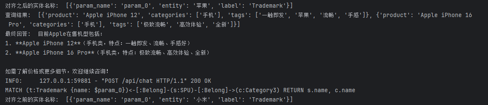
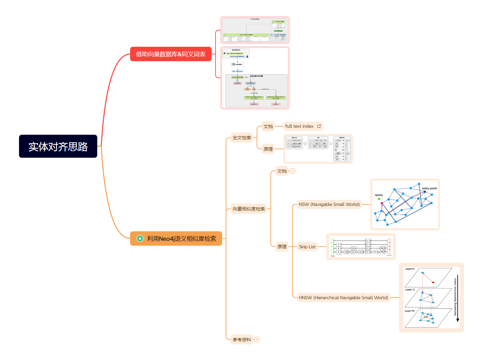
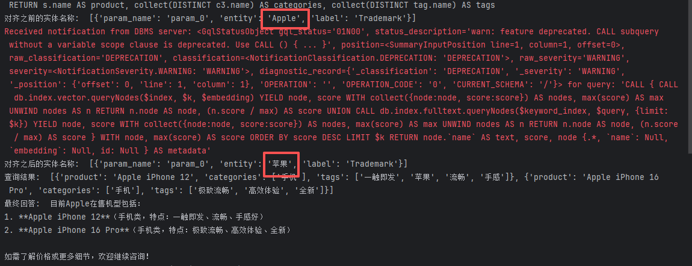
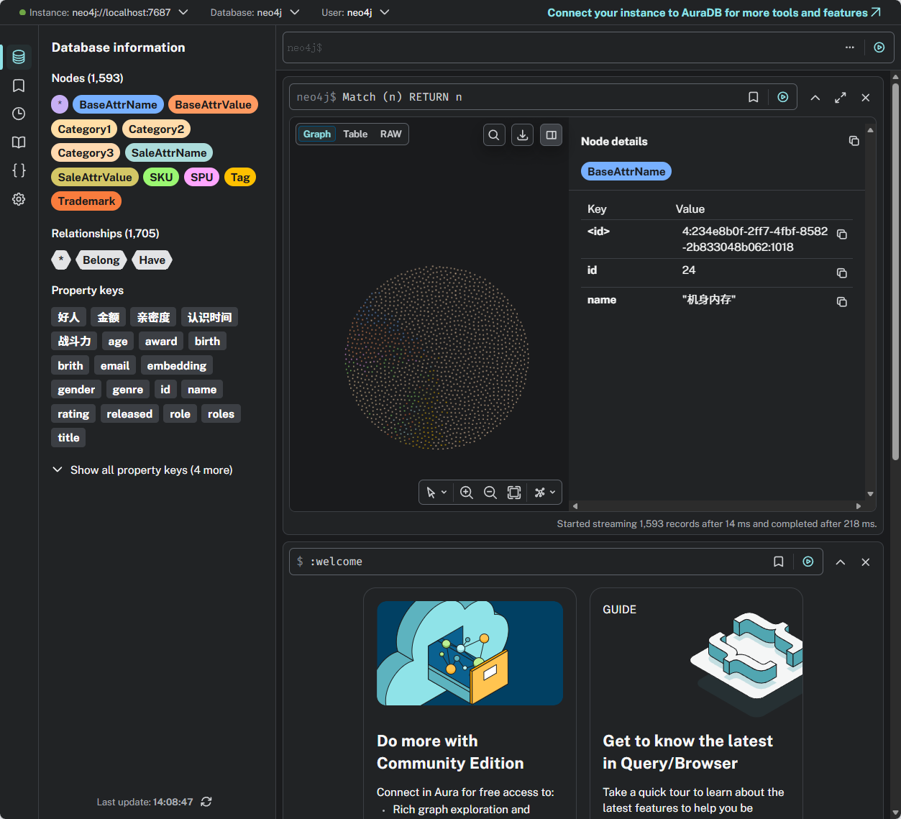

# E-commerce Map

面向电商商品数据的知识图谱与智能问答项目。项目将 MySQL 中的商品、类目、品牌、属性等结构化数据同步到 Neo4j，并结合中文 NER、实体对齐、向量检索和 LangChain 构建电商知识图谱问答系统。

> 本项目适合作为电商知识图谱、GraphRAG、实体对齐、商品标签抽取和智能客服问答方向的学习与实验工程。

## 项目亮点

- **电商知识图谱构建**：从 MySQL 商品业务库抽取类目、SPU、SKU、品牌、平台属性、销售属性等信息，写入 Neo4j。
- **NER 实体抽取**：基于 `bert-base-chinese` 训练商品文本实体识别模型，从商品描述中抽取标签实体。
- **实体对齐**：使用 Neo4j 全文索引与向量索引进行混合检索，将用户问题中的实体对齐到图数据库中的标准实体。
- **LangChain 问答链路**：使用大模型生成参数化 Cypher，查询 Neo4j 后再生成自然语言答案。
- **Web 交互服务**：基于 FastAPI 提供问答接口，并通过静态页面进行交互展示。

## 成果展示

### 业务流程



### 数据对齐原理



### 实体对齐效果



### Neo4j 图数据库效果



## 技术栈

- **Python**
- **Neo4j**：图数据库、Cypher 查询、全文索引、向量索引
- **MySQL**：原始电商业务数据源
- **LangChain**：图谱问答链路编排
- **DeepSeek**：大模型生成 Cypher 与自然语言答案
- **Hugging Face Transformers**：中文 BERT NER 模型训练与推理
- **BAAI/bge-large-zh-v1.5**：中文文本向量嵌入
- **FastAPI + Uvicorn**：Web API 服务
- **PyTorch / datasets / evaluate / seqeval**：NER 训练与评估

## 项目结构

```text
E-commerce_Map/
+-- data/
|   +-- ner/
|       +-- raw/                 # NER 原始标注数据
|       +-- processed/           # 处理后的训练、验证、测试数据
+-- figure/                      # README 展示图片与项目成果图
+-- logs/
|   +-- checkpoints/ner/         # NER 训练检查点与最佳模型
+-- src/
|   +-- configuration/
|   |   +-- config.py            # 项目路径、模型、数据库、大模型配置
|   +-- datasync/
|   |   +-- table_sync.py        # MySQL 表数据同步到 Neo4j
|   |   +-- text_sync.py         # 商品文本 NER 抽取并写入 Neo4j
|   |   +-- utils.py             # MySQL 读取与 Neo4j 写入工具
|   +-- ner/
|   |   +-- preprocess.py        # NER 数据预处理
|   |   +-- train.py             # NER 模型训练
|   |   +-- eval.py              # NER 模型评估
|   |   +-- predict.py           # NER 推理与实体抽取
|   +-- web/
|       +-- app.py               # FastAPI 应用入口
|       +-- service.py           # LangChain + Neo4j 问答服务
|       +-- utils.py             # Neo4j 全文索引与向量索引构建
|       +-- static/              # 前端静态页面
+-- neo4j_driver.py              # Neo4j 连接测试示例
```

## 核心流程

1. **结构化数据同步**

   `src/datasync/table_sync.py` 从 MySQL 电商业务表中读取商品、类目、品牌和属性数据，并写入 Neo4j 节点与关系。

2. **商品文本实体抽取**

   `src/ner/preprocess.py` 将原始标注数据转换为 B/I/O 序列标注格式；`src/ner/train.py` 使用中文 BERT 训练 NER 模型；`src/datasync/text_sync.py` 使用训练好的模型从商品描述中抽取标签并写入图谱。

3. **索引构建与实体对齐**

   `src/web/utils.py` 为 Neo4j 中的商品、品牌、类目等节点创建全文索引和向量索引。问答时，系统会对用户问题中识别出的实体进行混合检索，得到图数据库中的标准实体名称。

4. **知识图谱问答**

   `src/web/service.py` 使用 LangChain 调用大模型生成参数化 Cypher，执行 Neo4j 查询后，再结合查询结果生成自然语言答案。

## 环境准备

建议使用 Python 3.10+。

```bash
pip install fastapi uvicorn pymysql neo4j python-dotenv
pip install torch transformers datasets evaluate seqeval
pip install langchain-community langchain-core langchain-deepseek neo4j-graphrag sentence-transformers
```

如果使用 GPU 训练 NER，请根据本机 CUDA 版本安装对应的 PyTorch。

## 配置说明

主要配置位于：

```text
src/configuration/config.py
```

需要根据本地环境配置：

- MySQL 连接信息：`MYSQL_CONFIG`
- Neo4j 连接信息：`NEO4j_CONFIG`
- DeepSeek API Key：`DEEPSEEK_API_KEY`
- NER 基座模型：`MODEL_NAME`
- 训练批大小、轮数、学习率等超参数

**开源前重要提醒**：请不要把真实数据库密码、Neo4j 密码或 API Key 提交到 GitHub。建议将敏感配置改为 `.env` 或系统环境变量，并在仓库中提供 `.env.example`。

## 使用方法

以下命令默认在项目根目录执行。Windows PowerShell 可以先设置：

```powershell
$env:PYTHONPATH="src"
```

Linux/macOS 可以使用：

```bash
export PYTHONPATH=src
```

### 1. 处理 NER 数据

```bash
python src/ner/preprocess.py
```

### 2. 训练 NER 模型

```bash
python src/ner/train.py
```

训练完成后，最佳模型会保存到：

```text
logs/checkpoints/ner/best.pt
```

### 3. 评估 NER 模型

```bash
python src/ner/eval.py
```

### 4. 同步结构化数据到 Neo4j

请先确保 MySQL 和 Neo4j 服务已经启动，并且 `config.py` 中连接信息正确。

```bash
python src/datasync/table_sync.py
```

### 5. 抽取商品文本标签并写入 Neo4j

```bash
python src/datasync/text_sync.py
```

### 6. 创建 Neo4j 全文索引与向量索引

```bash
python src/web/utils.py
```

### 7. 启动 Web 问答服务

```bash
python src/web/app.py
```

启动后访问：

```text
http://localhost:8000
```

接口地址：

```text
POST http://localhost:8000/api/chat
```

请求示例：

```json
{
  "message": "Apple 有哪些商品？"
}
```

响应示例：

```json
{
  "message": "根据知识图谱查询结果生成的回答"
}
```

## 图谱数据模型

项目中主要涉及以下节点类型：

- `Category1`、`Category2`、`Category3`：一、二、三级商品分类
- `SPU`：标准商品单元
- `SKU`：库存商品单元
- `Trademark`：品牌
- `BaseAttrName`、`BaseAttrValue`：平台属性名与属性值
- `SaleAttrName`、`SaleAttrValue`：销售属性名与属性值
- `Tag`：从商品描述中抽取出的文本标签

主要关系包括：

- `Belong`：归属关系，例如 SKU 属于 SPU、SPU 属于三级分类、SPU 属于品牌
- `Have`：拥有关系，例如商品拥有属性、分类拥有属性、SPU 拥有 Tag

## NER 任务说明

NER 模型使用 B/I/O 标注体系：

- `B`：实体开始
- `I`：实体内部
- `O`：非实体字符

当前模型基于 `google-bert/bert-base-chinese` 进行 token classification 微调，用于从商品标题或商品描述中抽取关键标签实体。

## 实体对齐说明

用户问题中的商品名、品牌名、类目名可能与图数据库中的标准名称不完全一致。项目使用以下方式完成实体对齐：

1. 大模型从用户问题中识别需要对齐的实体及其节点类型。
2. 使用 Neo4jVector 对对应标签节点进行混合检索。
3. 将召回结果作为标准实体替换 Cypher 参数。
4. 使用对齐后的参数执行图数据库查询。

这种方式可以提升问答系统对别名、缩写、模糊商品名和中英文混合输入的容错能力。


## License

如果计划开源，可以根据使用场景选择许可证：

- 学习交流优先：MIT License
- 希望保留更多版权约束：Apache License 2.0
- 数据或模型权重另有来源时，请同时遵守对应许可证

## 致谢

本项目使用 Neo4j、LangChain、Hugging Face Transformers、DeepSeek、FastAPI 等开源生态工具完成电商知识图谱构建与智能问答实验。
